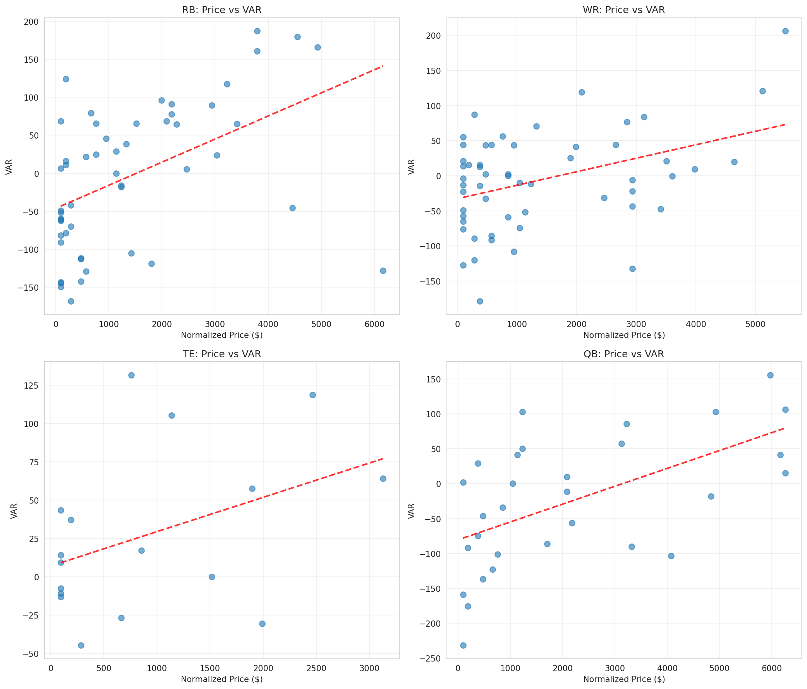
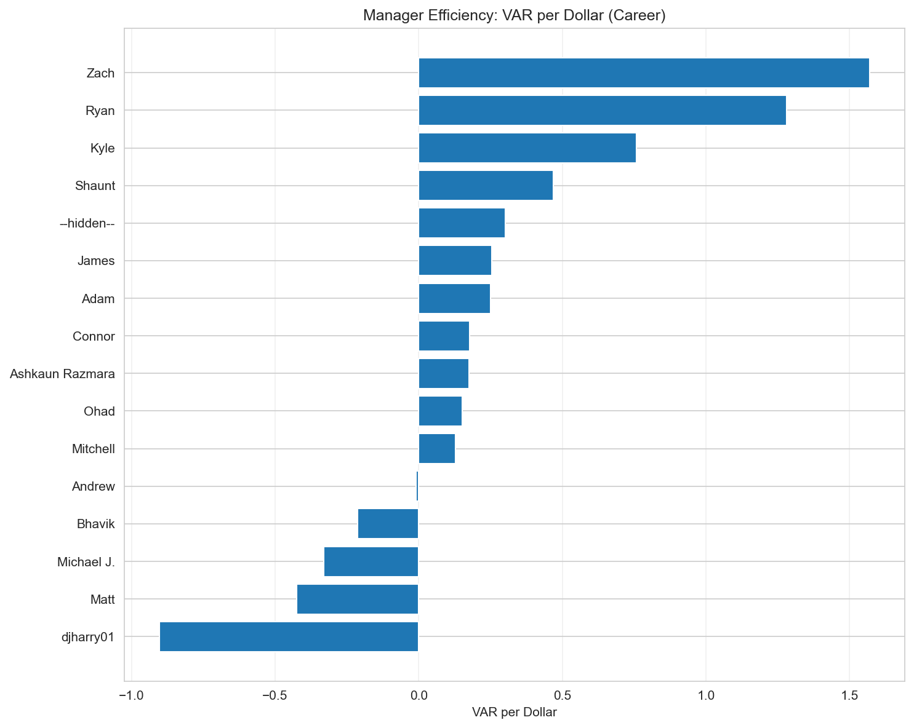
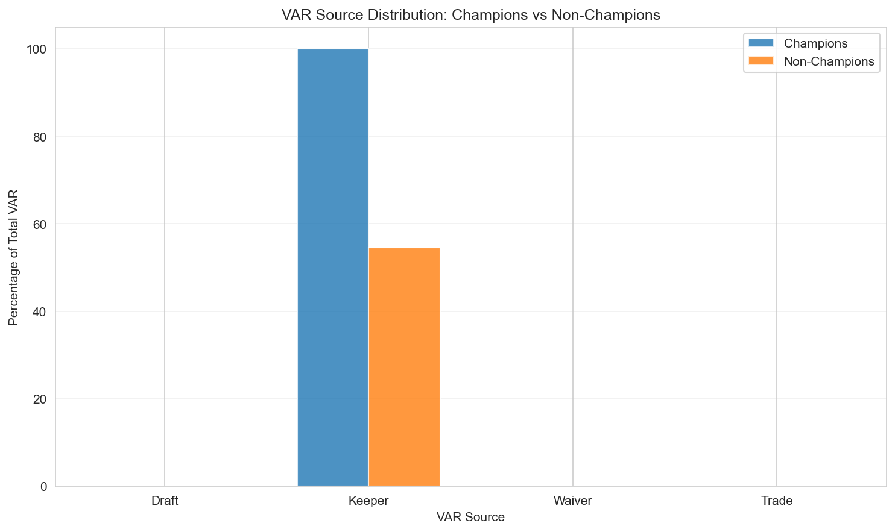

# Fantasy Football League Review: Outcome-Linked Analysis

**Analysis Period:** 2018-2024

## Assumptions & Methodology

- **Replacement Baseline:** Points of player ranked at `num_teams * starters_per_position` for each position
- **VAR Calculation:** Player Points - Replacement Baseline Points
- **Price Normalization:** Prices normalized to baseline season accounting for keeper inflation
- **Consistency Score:** Normalized score = `(1 / (1 + std)) * median`, scaled to 0-100
- **Archetype Definitions:**
  - CONSISTENT_CONTENDER: median_wins ≥ league_median AND std_wins ≤ league_median_std
  - BOOM_BUST: std_wins ≥ league_75th_percentile_std
  - LOTTERY: championships ≥ 1 AND median_wins < league_median
  - STEADY_BUT_UNLUCKY: median_wins ≥ league_60th_percentile AND championships = 0
- **Gini Coefficient:** Measure of VAR concentration (0 = perfectly equal, 1 = all value in one team)
- **Expected Wins (All-Play Model):** For each week, rank all teams by points. Team earns (num_teams - rank) / (num_teams - 1) expected wins. Sum across weeks.
- **Win Luck:** actual_wins - expected_wins. Positive = lucky, negative = unlucky
- **PA_diff:** points_against - league_avg_PA. Positive = faced tougher schedule (more points allowed)
- **Schedule Difficulty:** Normalized opponent strength. Positive = harder schedule
- **Lineup Efficiency:** actual_points / optimal_points (proportion of maximum points achieved)
- **Bench Waste Rate:** total_bench_points / total_optimal_points (wasted potential)
- **Loss Types:** UNLUCKY_LOSS (high score but lost), LINEUP_LOSS (inefficient lineup), DEPTH_LOSS (insufficient roster), SKILL_LOSS (otherwise)

---

## A. League Inefficiencies

### Spending Efficiency by Position

| Position | Avg $/VAR | Avg VAR/$ | Avg VAR | Avg Price | Players |
|----------|-----------|-----------|---------|-----------|---------|
| QB | $inf | -2.703 | 10.1 | $4137.7 | 127 |
| RB | $inf | -0.574 | 10.4 | $3600.1 | 284 |
| TE | $inf | 0.381 | 22.4 | $1897.8 | 103 |
| WR | $inf | -2.159 | -3.6 | $3132.6 | 323 |

**Best Value Position:** TE ($0.381 VAR per dollar)

**Worst Value Position:** QB ($-2.703 VAR per dollar)

## B. Manager Efficiency Leaderboard

### Top Managers by VAR per Dollar (Career)

| Rank | Manager | VAR/$ | Total VAR | Total Spend | Wins | Championships | Seasons |
|------|---------|-------|-----------|-------------|------|---------------|---------|
| 1 | Zach | 1.569 | 1826.5 | $1164 | 42 | 1 | 6 |
| 2 | Ryan | 1.279 | 1525.1 | $1192 | 40 | 1 | 6 |
| 3 | Kyle | 0.758 | 896.4 | $1182 | 45 | 0 | 6 |
| 4 | Shaunt | 0.468 | 560.9 | $1198 | 34 | 0 | 6 |
| 5 | --hidden-- | 0.302 | 299.7 | $993 | 36 | 0 | 5 |
| 6 | James | 0.254 | 304.5 | $1200 | 42 | 1 | 6 |
| 7 | Adam | 0.249 | 298.8 | $1200 | 39 | 0 | 6 |
| 8 | Connor | 0.178 | 212.8 | $1195 | 49 | 0 | 6 |
| 9 | Ashkaun Razmara | 0.176 | 205.2 | $1169 | 36 | 0 | 6 |
| 10 | Ohad | 0.151 | 149.7 | $989 | 42 | 2 | 5 |

### Manager VAR Sources (Average % by Source)

| Manager | Draft % | Keeper % | Waiver % | Trade % |
|---------|---------|----------|----------|---------|
| --hidden-- | 0.0% | 60.0% | 0.0% | 0.0% |
| Adam | 0.0% | 50.0% | 0.0% | 0.0% |
| Andrew | 0.0% | 33.3% | 0.0% | 0.0% |
| Ashkaun Razmara | 0.0% | 50.0% | 0.0% | 0.0% |
| Bhavik | 0.0% | 50.0% | 0.0% | 0.0% |
| Connor | 0.0% | 50.0% | 0.0% | 0.0% |
| James | 0.0% | 50.0% | 0.0% | 0.0% |
| Kyle | 0.0% | 83.3% | 0.0% | 0.0% |
| Matt | 0.0% | 0.0% | 0.0% | 0.0% |
| Michael J. | 0.0% | 33.3% | 0.0% | 0.0% |

## C. Draft Skill Analysis

### Hit Rates (Career)

| Manager | Hit Rate | Bust Rate | Top 3 Pick VAR | Avg VAR |
|---------|----------|-----------|----------------|---------|
| --hidden-- | 100.0% | 49.1% | 229.3 | 5.7 |
| Adam | 100.0% | 47.3% | 106.4 | 5.4 |
| Andrew | 100.0% | 47.5% | 101.5 | -0.2 |
| Ashkaun Razmara | 100.0% | 45.6% | 126.1 | 3.6 |
| Bhavik | 100.0% | 49.1% | 26.5 | -4.5 |
| Connor | 100.0% | 45.5% | 116.6 | 3.2 |
| James | 100.0% | 48.3% | 211.0 | 5.1 |
| Kyle | 100.0% | 36.7% | 159.9 | 14.9 |
| Matt | 100.0% | 51.6% | 106.7 | -7.9 |
| Michael J. | 100.0% | 60.0% | 120.5 | -6.5 |

### Hit Rates by Draft Tier (League-Wide)

| Tier | Hit Rate | Bust Rate | Avg VAR | Players |
|------|----------|-----------|---------|---------|
| Tier 1 | 100.0% | 41.5% | 9.0 | 386 |
| Tier 2 | 100.0% | 48.2% | 6.2 | 342 |
| Tier 3 | 100.0% | 53.2% | -1.9 | 109 |

## D. Keeper Skill

### Keeper Surplus Analysis

| Position | Avg Surplus | Avg VAR | Surplus-VAR Correlation |
|----------|-------------|---------|------------------------|
| QB | $4122.16 | 10.1 | 0.158 |
| RB | $3580.23 | 10.4 | 0.158 |
| TE | $1886.92 | 22.4 | 0.158 |
| WR | $3115.90 | -3.6 | 0.158 |

## F. Champion Blueprint

### What Champions Did Differently

**Top 3 Differentiators:**

1. **pct_VAR_from_keeper**: Champions +83.3% different (effect size: 1.28)
2. **total_VAR**: Champions +426.4% different (effect size: 1.08)
3. **keeper_VAR**: Champions +426.4% different (effect size: 1.08)

### Champion Seasons

| Season | Manager | VAR/$ | Total VAR | Draft % | Keeper % | Waiver % | Trade % |
|--------|---------|-------|-----------|---------|----------|----------|---------|
| 2018 | Bhavik | 1.670 | 329.0 | 0.0% | 100.0% | 0.0% | 0.0% |
| 2019 | Ryan | 1.122 | 221.0 | 0.0% | 100.0% | 0.0% | 0.0% |
| 2020 | Ohad | 1.168 | 228.9 | 0.0% | 100.0% | 0.0% | 0.0% |
| 2021 | Zach | 1.372 | 274.4 | 0.0% | 100.0% | 0.0% | 0.0% |
| 2022 | James | 2.708 | 541.6 | 0.0% | 100.0% | 0.0% | 0.0% |
| 2023 | Ohad | 0.089 | 17.8 | 0.0% | 100.0% | 0.0% | 0.0% |

### Champions vs Non-Champions Comparison

| Metric | Champion Mean | Non-Champion Mean | Difference | Effect Size |
|--------|---------------|-------------------|------------|-------------|
| pct_VAR_from_keeper | 100.00 | 54.55 | +45.45 | 1.28 |
| total_VAR | 268.77 | 51.06 | +217.72 | 1.08 |
| keeper_VAR | 268.77 | 51.06 | +217.72 | 1.08 |
| VAR_per_dollar | 1.35 | 0.26 | +1.09 | 1.08 |
| pct_VAR_from_draft | 0.00 | 0.00 | +0.00 | 0.00 |
| pct_VAR_from_waiver | 0.00 | 0.00 | +0.00 | 0.00 |
| pct_VAR_from_trade | 0.00 | 0.00 | +0.00 | 0.00 |
| draft_VAR | 0.00 | 0.00 | +0.00 | 0.00 |
| waiver_VAR | 0.00 | 0.00 | +0.00 | 0.00 |
| trade_VAR | 0.00 | 0.00 | +0.00 | 0.00 |

---

## Visualizations

## G. Consistency vs Volatility

### Most Consistent Managers

**Most Consistent (Wins):** djharry01 (Score: 100.0)
- Median Wins: 9.0
- Std Wins: nan

**Most Volatile (Wins):** Bhavik (Score: 0.0)
- Median Wins: 5.5
- Std Wins: 3.27

### Champions vs Non-Champions: Consistency

- **Champions Avg Std Wins:** 2.48
- **Non-Champions Avg Std Wins:** 1.99
- **Insight:** Champions are more volatile (higher std)

### Consistency Score Rankings (Top 5)

| Rank | Manager | Consistency Score (Wins) | Median Wins | Std Wins |
|------|---------|-------------------------|-------------|----------|
| 1 | djharry01 | 100.0 | 9.0 | nan |
| 2 | Connor | 31.1 | 8.0 | 1.17 |
| 3 | --hidden-- | 26.6 | 7.0 | 1.10 |
| 4 | Zach | 26.2 | 7.5 | 1.26 |
| 5 | James | 18.2 | 7.5 | 1.79 |

### Manager Archetypes

- **UNCLASSIFIED**: 6 managers
- **CONSISTENT_CONTENDER**: 4 managers
- **BOOM_BUST**: 3 managers
- **STEADY_BUT_UNLUCKY**: 2 managers
- **LOTTERY**: 1 managers

**CONSISTENT_CONTENDER Examples:**
- Connor: 8.0 median wins, 1.17 std, 0 championships
- --hidden--: 7.0 median wins, 1.10 std, 0 championships
- James: 7.5 median wins, 1.79 std, 1 championships

**BOOM_BUST Examples:**
- Ohad: 8.0 median wins, 3.36 std, 2 championships
- Ryan: 6.5 median wins, 2.73 std, 1 championships
- Adam: 6.0 median wins, 3.33 std, 0 championships

**LOTTERY Examples:**
- Bhavik: 5.5 median wins, 3.27 std, 1 championships

**STEADY_BUT_UNLUCKY Examples:**
- Kyle: 7.0 median wins, 2.51 std, 0 championships
- djharry01: 9.0 median wins, nan std, 0 championships

### Is High Variance Rewarded?

- **Correlation (Std Wins vs Championships):** 0.409
- **Insight:** Higher variance is positively correlated with championships

## H. Schedule Luck & Points Against

## I. Lineup Skill, Bench Waste & True Luck

*Weekly lineup analysis requires weekly roster snapshots which are not currently available in the data.*
*To enable this analysis, weekly roster data must be fetched from the Yahoo API or derived from transactions.*

### Value-to-Wins Conversion

Managers with strongest correlation between VAR and wins:

| Manager | VAR→Wins Corr | Draft VAR→Wins | Keeper VAR→Wins |
|---------|---------------|----------------|-----------------|
| Adam | 0.896 | N/A | 0.896 |
| Ryan | 0.873 | N/A | 0.873 |
| Ohad | 0.718 | N/A | 0.718 |
| Bhavik | 0.675 | N/A | 0.675 |
| Andrew | 0.659 | N/A | 0.659 |

---

## Key Takeaways

- **Most Efficient Manager:** Zach ($1.537 VAR per dollar)
- **Biggest Champion Differentiator:** pct_VAR_from_keeper
- **Most Consistent Manager:** djharry01
- **Most Championships:** Ohad (2)
